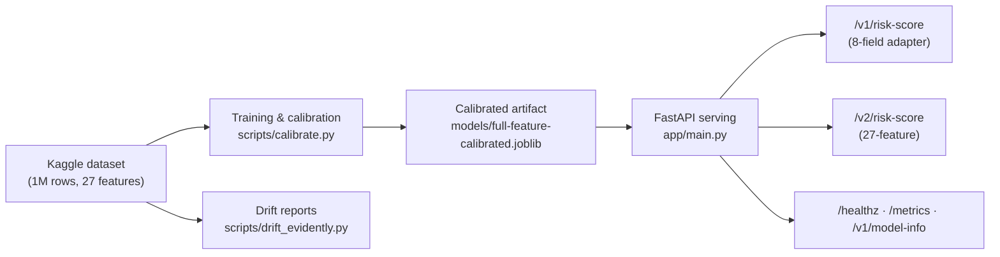

# MLOps Risk Platform

[](https://github.com/riogesulgon/fraud-detect/actions/workflows/ci.yml)
[](https://github.com/riogesulgon/actions/workflows/release.yml)
[](LICENSE)

A transaction-risk scoring demonstrator trained on the [Synthetic Credit Card Fraud (Interpretable 1M)](https://www.kaggle.com/datasets/harshjain123/synthetic-credit-card-fraud-interpretable) dataset (CC0-1.0, 1M rows, ~1.9% fraud). It is not suitable for live financial decisions; it targets a review-queue setting, not approve/decline.

## Architecture



## Quick start

```bash
make install
make data          # deterministic synthetic fixture data
make test
make run
curl -X POST http://localhost:8000/v1/risk-score -H 'content-type: application/json' -d '{"transaction_amount":145.5,"merchant_category":"electronics","country_risk_score":0.42,"account_age_days":730,"transaction_count_24h":3,"failed_auth_attempts_24h":0,"is_new_device":false,"hour_utc":14}'
```

## Docker

```bash
docker build -t risk-platform:local .
docker run -p 8000:8000 risk-platform:local
```

A prebuilt image is published to GHCR on every `v*` tag:

```bash
docker run -p 8000:8000 ghcr.io/riogesulgon/fraud-detect:v0.1.0
```

## Model versions

| Version | Features | Calibration | Test recall | Test precision | ROC-AUC | PR-AUC |
|---|---|---|---|---|---|---|
| v1 (`kaggle-*`) | 8-field adapter of the 27 Kaggle features | none | see `reports/evaluation.json` | — | — | — |
| v2 (`kaggle-full-calibrated`) | all 27 | Platt sigmoid, threshold 0.0110 | 81.3% | 4.56% | 0.8314 | 0.1996 |

`/v1/model-info` exposes model metadata including the training-data SHA-256 (`dataset_sha256`), so any served artifact can be tied to the exact data bytes used for training. Note the hash covers file bytes, not row sampling.

The calibrated artifact `models/full-feature-calibrated.joblib` (~200 KB) is committed for reproducible local serving; SHA-256 `1c43c6374bb0f9cc83c14862c44de64cdeb9d46cca980505dc955c2e952a79cb`. Regenerate with `make kaggle-data && make calibrate` when the dataset changes.

## Drift monitoring

```bash
make drift-evidently   # compares earliest 60k vs latest 20k rows, writes reports/drift_evidently.html
```

## CI/CD

- **CI** (every push/PR): ruff, train, pytest (9 tests), optional Kaggle dataset fetch + model-reports artifact, container smoke test of v1 and v2 endpoints.
- **Release** (on `v*` tags): image build, Trivy CRITICAL scan gate, push to GHCR, GitHub Release.
- To enable model reports in CI, add `KAGGLE_USERNAME` and `KAGGLE_KEY` as repository secrets.

## Limitations

- Synthetic data; patterns are not real fraud patterns.
- Low precision at the operating point (~22 alerts per confirmed fraud): suited to a review queue, not automation.
- The model card in `docs/model-card.md` documents both model paths, metrics, and honest limitations.

## License

MIT